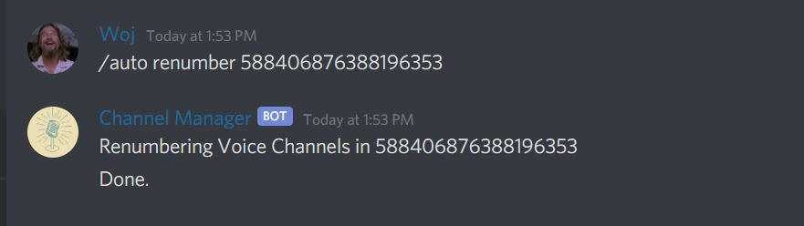
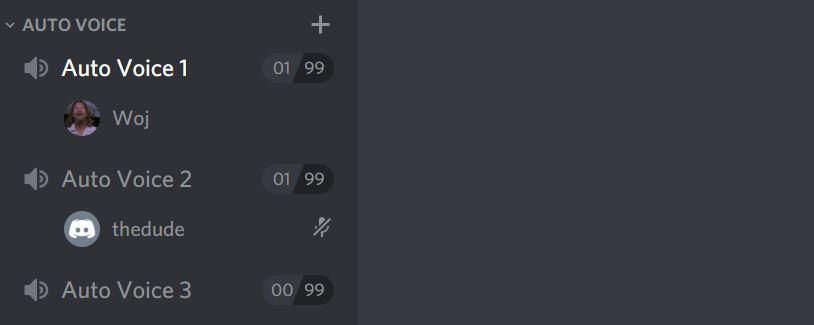

.. toctree::
   :caption: Table of Contents
   :maxdepth: 2
   :hidden:

Getting Started
===============
Inviting the Bot
----------------
You can invite the bot using the following url:

`https://discordapp.com/oauth2/authorize?client_id=524648043061051432&permissions=8&scope=bot <https://discordapp.com/oauth2/authorize?client_id=524648043061051432&permissions=8&scope=bot>`_

The Channel Manager Bot should have administration permissions to ensure that nothing prevents it from making, removing and renaming channels. If, however, you do not wish to give the bot full permissions, make sure the following permissions are enabled:

* Manage Server
* Manage Channels
* Create Invite
* Manage Nicknames
* Read Text Channels & See Voice Channels
* Send Messages
* Embed Links
* Manage Messages
* Add Reactions

Bot Administration
------------------
Bot Prefix
~~~~~~~~~~
| The initial prefix of the bot when it first enters a server is ``/``. However, the prefix can be customized. To set a custom prefix for your server, run the ``set prefix`` command. For example, if you want to set the bot prefix to an exclamation point (!), run the following command:
| ``/set prefix !``

.. image:: _static/bot_prefix.JPG
  :width: 600
  :alt: Bot Prefix

Auto Renumbering
~~~~~~~~~~~~~~~~
| There might be an instance when the number of channels gets out of order. This can be caused by a number of things, but the most common is that the API call lags due to network interference. To combat this, the Channel Manager Bot includes an Auto Renumber command to keep your channels organized. To renumber an Auto Voice Group, copy the ID of the category the group lives under and run the following command:
| ``/auto renumber 588406876388196353``
| "588406876388196353" in this example is the ID of the category.

.. image:: _static/auto_renumber_1.JPG
  :width: 600
  :alt: Auto Renumber 1

Import Data
~~~~~~~~~~~
This version of the Channel Manager Bot is a rewrite of the original Auto Voice Channel Tracker Bot. If you previously had your auto voice channel groups living under that bot, you can import the data from the old database into the new one by using the ``import guilddata`` command. If the server isn't found in the old database, then you will need to recreate the auto voice channel groups.