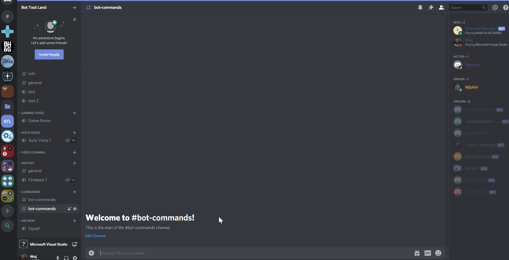
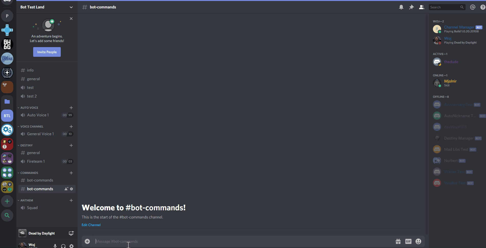

.. toctree::
   :caption: Table of Contents
   :maxdepth: 2
   :hidden:

Setup
=====
The following setup commands require Administrator permissions.

Creating an Auto Voice Group
----------------------------
Auto Voice Groups allow server managers to keep their voice channel lists clear of clutter. When you set up a Voice
Channel Group, the Voice Channel Manager Bot creates the initial channel. When users join the channel a new one is
created, and when they leave it is removed.

| To create an Auto Voice Group, run the ``/create autovoice`` command. You will need to specify the name of the Auto Voice Group, the Category ID for which the group will live and the user limit of each voice group channel. For example:
| ``/create autovoice "General Voice" 535488577296138243 10``
| When you set the name of the Auto Voice Group, ensure that you are using double quotes around the name (""). You can leave the user limit parameter blank if you do not wish to set a user limit.

Creating Game Rooms
-------------------
Game Rooms are channels that are tailored to the type of game that a user is playing. The voice channel gets renamed
based on what the majority of players are playing in the channel. Like Auto Voice Groups, new channels are created
when a user joins a Game Room so that there is always a free channel. Presently, the Discord API doesn't handle Custom
Statuses that well, so if a user joins a Game Room with a custom status, the custom status will be used as the name of
the Voice Channel.

| To create Game Rooms, run the ``/create gameroom`` command. For example:
| ``/create gameroom``
| You can specify a category ID if you would like, however, running the command as is will create the category for you. In addition, you can set a User Limit or leave the parameter blank if you do not wish to have a User Limit. If you do decide to set a User Limit on the Game Room channels, you will need to create your own Game Room Category. For example:
| ``/create gameroom 700402574452588595 15``
| The above command will create the Game Room group under a category with an ID of 700402574452588595 and set a user limit to 15.

Creating Temporary Voice Channels
---------------------------------
Temporary Voice Channels give users of a server the freedom to create their own custom named channel. To keep things tidy,
the channels are deleted once all users have left the channel.

| To create a Temporary Voice Channel list, run the ``/create temproom`` command. For example:
| ``/create temproom``
| You can specify a category ID if you would like, however, running the command as is will create the Temporary Category for you along with a text channel that gives your users instructions on how to make their own Voice Channel. For example:
| ``/create temproom 550753598271913986``
| The above command will create the Temporary Channel List under a category with an ID of 550753598271913986.

.. image:: _static/temp_room_command.gif
  :width: 800
  :alt: Temp Room
